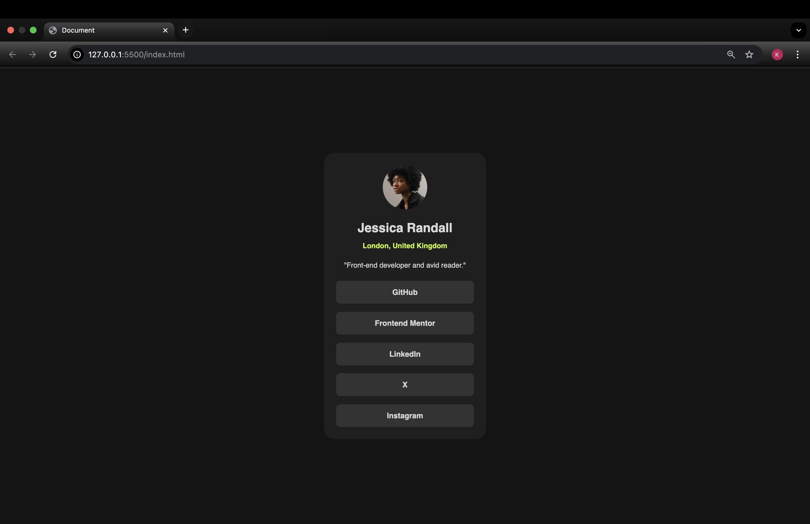

# Frontend Mentor challenge - Social links profile

A simple social links profile card built with HTML and CSS (SCSS).  
The card is fully responsive and uses modern Flexbox techniques for layout and centering.

## Build with:

HTML  
CSS (SCSS)

## Features

Centered card using Flexbox and Hover effects on links.

Link: https://minkons.github.io/social-links-profile/
